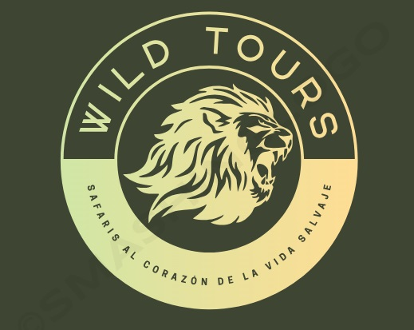

# WildTours

## Descripción de mi proyecto

Voy a crear una empresa llamada WildTours, dedicada a la organización de safari. El principal objetivo es ser capaz de proporcionar una web completa con todos los servicios que ofrecemos, todos los destinos, y sobre todo explicar quienes somos.

## Servicios que ofrecerá mi página web

- Inicio
- Destinos
- Por qué con nosotros
- Formulario para adaptarnos a su presuspuesto
- Testimonios
- Contáctanos
- Promociones

## Slogan

_"Safaris al corazón de la vida salvaje"_

## Logo

## La elección de colores y la imagen del león tiene varias razones:

- **Naturaleza y aventura:** El marrón representa la tierra y el terreno del safari, mientras que el verde simboliza la vegetación y la vida silvestre. El marrón tiene un tono anaranjado ya que también se puede relacionar con una puesta de sol africana.

- **Elegancia y lujo:** Un león es a menudo visto como un símbolo de fuerza y poder. El león en el centro del logotipo podría simbolizar la protección y la atención a los detalles que la empresa brinda a los clientes.

- **Realeza y liderazgo:** Los leones también han sido históricamente asociados con la realeza y liderazgo. Podría considerarse que la empresa es líder en la industria de viajes y sus servicios de alta calidad.
