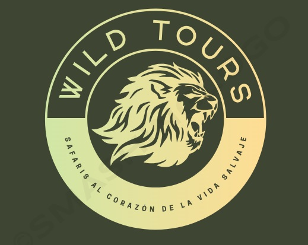

# WildTours

## Logo



## Colores para la web:

-**Marrón:** El marrón representa la tierra y el terreno del safari.

-**Verde:** El verde simboliza la vegetación y la vida silvestre.

-**Beige** El beige representa la arena. El beige es el color que usaré de fondo.

**Captura ejemplos** 

[Abrir documento HTML](../colores/colores.html)

```html
<!DOCTYPE html>
<html>
  <head>
    <link rel="stylesheet" type="text/css" href="colores.css" />
  </head>

  <body>
    <div class="forma">
      <div class="color marron">
        <p>#723F00</p>
      </div>
      <div class="color beige">
        <p>#FFFACD</p>
      </div>
      <div class="color verde">
        <p>#006400</p>
      </div>
    </div>
  </body>
</html>
```
[Abrir documento CSS](../colores/colores.css)

``` css
 .forma {
    display: flex;
    justify-content: space-between;
}

.color {
    width: 200px;
    height: 150px;
    display: flex;
    flex-direction: column;
    align-items: center;
    justify-content: flex-end;
    background-color: white;
    border: 1px solid #000;
    padding: 10px;
    margin: 5px;
    justify-content: center;
   
}

.marron {
    background-color:  #723F00;
}

.beige {
    background-color: #006400;
}

.verde {
    background-color: #FFFACD;
}

```

